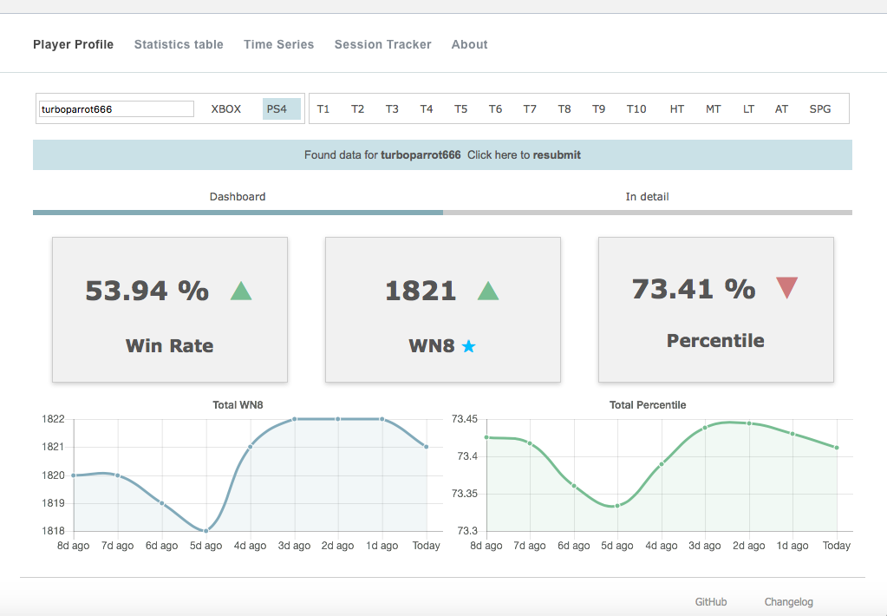
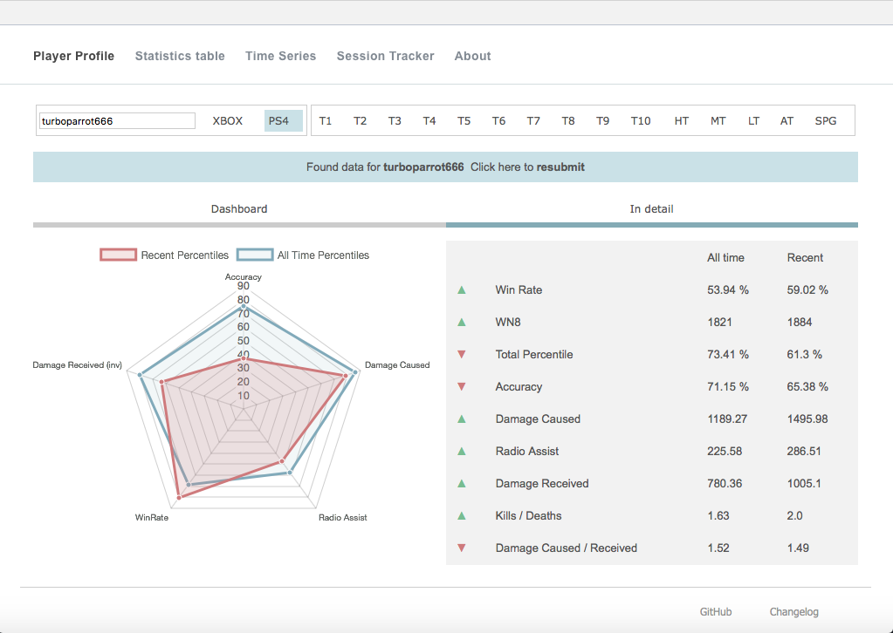
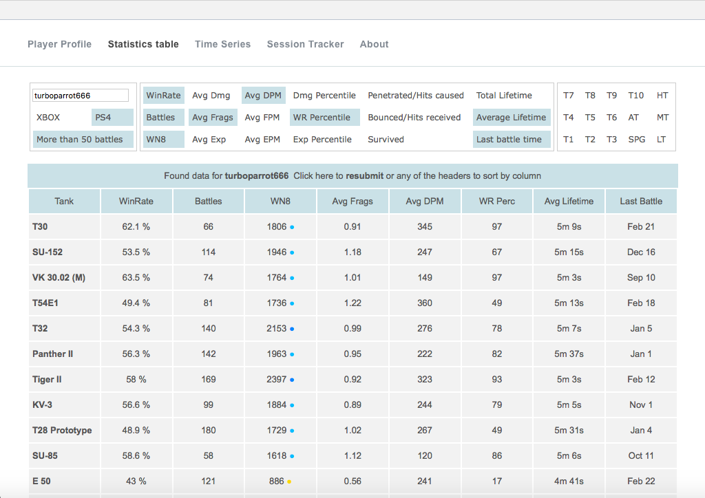
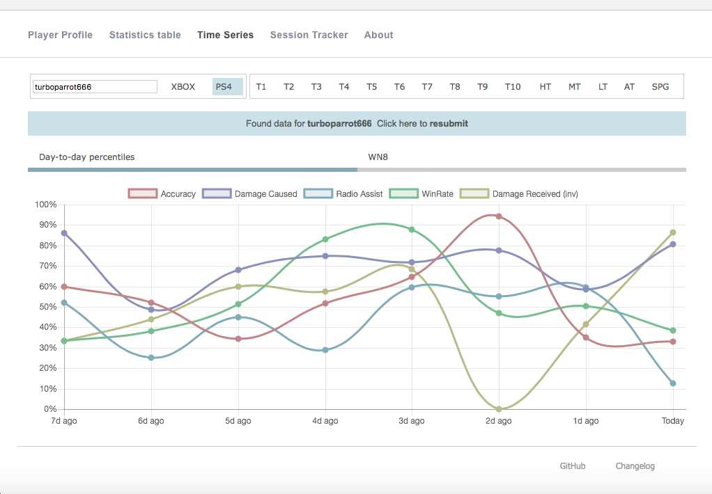
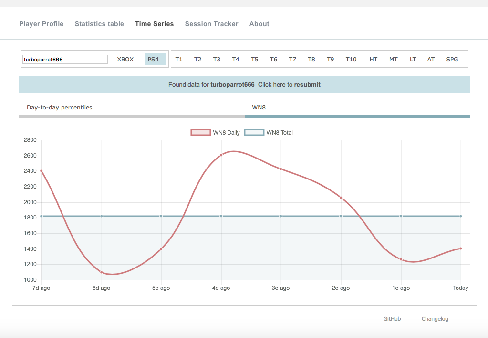
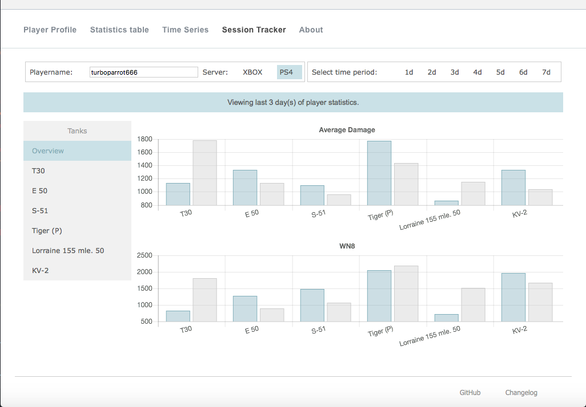
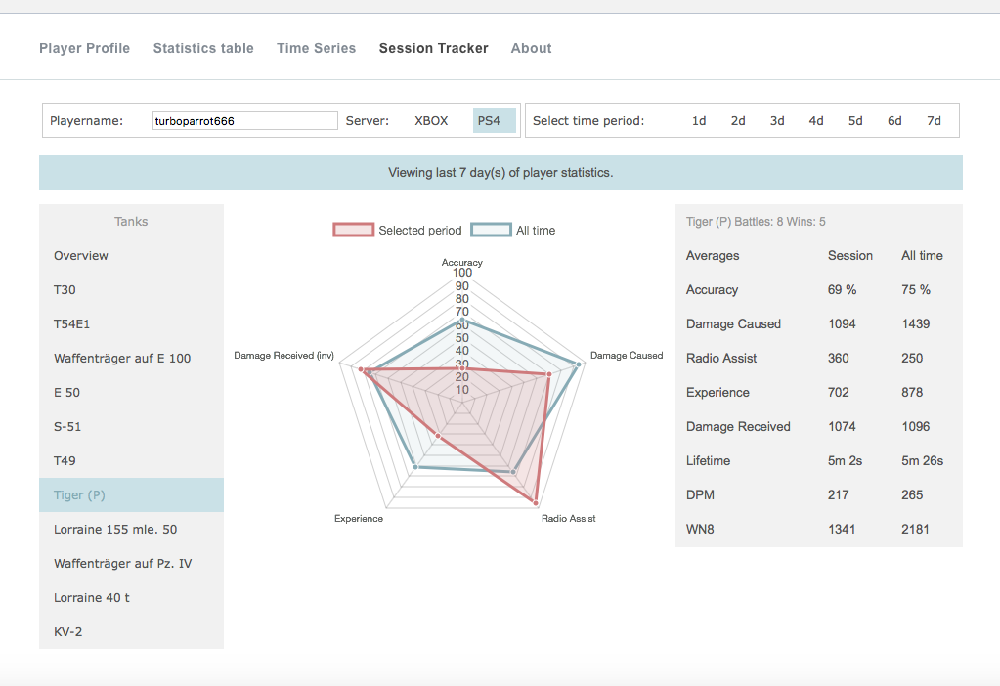

#### Features overview:

*Pictures as of February 22*

###### Player Profile

General player statistics dashboard with performance change indicators, WN8 color tag and two charts showing cumulative WN8 and percentile for the last 7 days. In depth general statistics with radar chart showing the difference between all-time results and recent player performance.

Main dashboard                       |  In-depth
------------------------------------ | ------------------------------------
 | 

###### Statistics Table

Main page                              |
---------------------------------------|-----------------------------------
 | Very handy to view different vehicles and how they compare to each other. Filtering and sorting options available.

###### Time Series

Charts to show day-to-day difference in performance and the recent trend.

Day-to-day percentiles            | WN8 Day-to-day + Total
----------------------------------|----------------------------------
 | 

###### Session Tracker

Allows to analyze vehicle-by-vehicle performance in various periods (from 1 to 7) days.

Overview                              | Vehicle view
--------------------------------------|-------------------------------------
 | 

#### Technicals

###### Dependencies:
- Python:
  - flask
  - flask_sqlalchemy
  - requests
  - json
  - pickle
  - datetime
- JavaScript:
  - Charts.js
